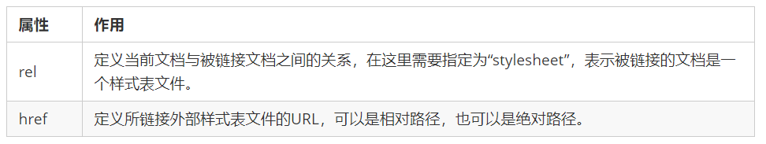
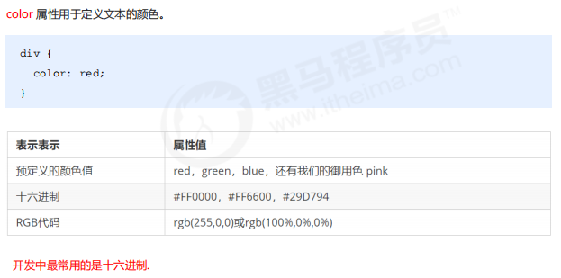
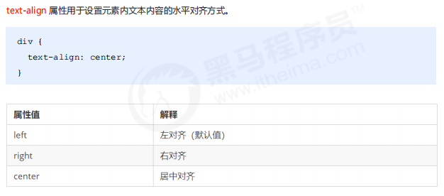
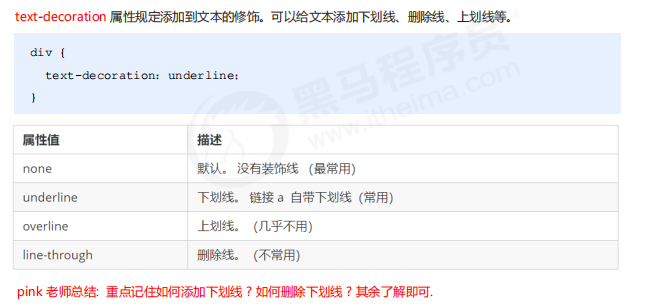
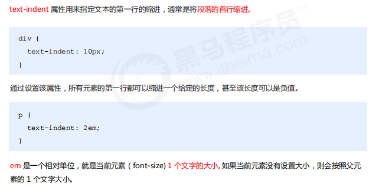
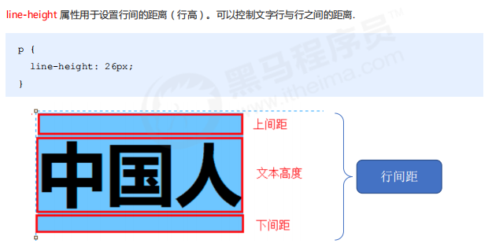

# CSS简介

- CSS 是层叠样式表 ( Cascading Style Sheets ) 的简称.
- CSS 是也是一种标记语言主要用于设置 HTML 页面中的文本内容（字体、大小、对齐方式等）、图片的外形（宽高、边框样式、边距等）以及版面的布局和外观显示样式。
- CSS 让我们的网页更加丰富多彩，布局更加灵活自如。简单理解：CSS 可以美化 HTML , 让 HTML 更漂亮， 让页面布局更简单。
- CSS 最大价值: 由 HTML 专注去做结构呈现，样式交给 CSS，即 结构 ( HTML ) 与样式( CSS ) 相分离

# CSS的三种引入方式

## 1. 嵌入式< head>

​		内部样式表（嵌入式）

即将所有的CSS代码都写到**一个style标签**里面，这个标签一般放在**head标签内部**，规范优雅。

```html
 <head>
        <style>
            h4 {
                color: blue;
                font-size: 100px;
            }
        </style>
</head>
```

## 2. 行内式

即写在单个html标签的属性里面，只能修改一个标签，很没用哦！

style = "color: red; font-size: 12px;"

```html
<div style="color: red; font-size: 12px;">青春不常在，抓紧谈恋爱</div>
```

##3. 外链式(most)

把所有样式单独写到CSS 文件中，之后把CSS文件引入到 HTML 页面中使用

引入外部样式表分为两步：

1. 新建一个后缀名为 .css 的样式文件，把所有 CSS 代码都放入此文件中。

2. 在 HTML 页面中，使用<link> 标签引入这个文件。

   ```html
   <head>
     <link rel="stylesheet" href="css文件路径">
   </head>
   ```

   

   

# CSS语法规范

​		**选择器 + 多条声明**


- 选择器是用于指定 CSS 样式的 HTML 标签，花括号内是对该对象设置的具体样式；
- key : value
- 多个 “ 键值对 ” 之间用英文 “  ;  ” 进行区分

# CSS代码风格

- **样式格式书写**

  1. 紧凑格式   
        	 h3 { color: deeppink; font-size: 20px;}
  2. 展开格式   
            h3 {
                    color: pink;
                    font-size: 20px;    
             }

    强烈推荐第二种格式， 因为更直观。

- **样式大小写风格**

  1. 小写格式
         h3 {
             color: pink;
         	}
  2. 大写格式
          H3 {
             COLOR: PINK;   
              }

  ​      强烈推荐样式选择器，属性名，属性值关键字全部使用小写字母，特殊情况除外。

- **样式空格风格**

  h3  {
           color: pink;    
  }
  	h3后一个空格，color：后面一个空格

# CSS基础选择器

作用：选择某个具体的标签进行操作。

选择器分为基础选择器和复合选择器两个大类：

- 基础选择器是由单个选择器组成的 
- 基础选择器又包括：**标签**选择器、**类**选择器、**id** 选择器和**通配符**选择器

**总览：**


## 1. 标签选择器

就是选取HTML中的标签名称，只能选择一种类型的标签，如p, div, 等。

优点：能快速为页面中同类型的标签统一设置样式。

缺点：不能设计差异化样式，只能选择全部的当前标签。

```css
标签名{
 属性1: 属性值1; 
 属性2: 属性值2; 
 属性3: 属性值3; 
 ...
}
```

## 2. 类选择器（最常用）

可以单独选一个或者几个标签。

**步骤：**

1. 先定义一个类，然后写上该类的属性。

   ```css
   .类名 {
    属性1: 属性值1; 
    ...
   }
   
   例如：定一个red类，属性是将颜色变成红色。
   .red {
    color: red;
   }
   ```

2. 然后需要在**html标签**中需要用**class属性**来调用 class 类的意思。在标签的属性里面调用就行

```html
<div class=‘red’> 变红色 </div>
```

- **进阶：：多类名使用方式**

  ```html
  <div class="red font20">亚瑟</div>
  ```

  (1) 在标签class 属性中写 多个类名

  (2) 多个类名中间必须用**空格分开**

  (3) 这个标签就可以分别具有这些类名的样式

## 3. id选择器

- 为特定 id 的 HTML 元素指定特定的样式。
- HTML 元素以 id 属性来设置 id 选择器，CSS 中 id 选择器以“#" 来定义。

**注意：**HTML里面的id是唯一的，是主键，可以区分不同的标签的属性。

```css
#id名 {
 属性1: 属性值1; 
 ...
}

将 id 为 nav 元素中的内容设置为红色
<style>
		#nav {
 			color: red; 
			}
</style>
```

## 4. 通配符选择器

表示选取页面中所有标签，统一使用该属性。

```css
<style>
	* {
   		属性1: 属性值1; 
   		...
		}
</style>
```

# CSS字体属性

CSS的语法是**选择器 + 多条声明**。这个就是其中一条。


例如：

```css
body { font-family:"微软雅黑";} 
body {font-family: Arial,"Microsoft Yahei", "微软雅黑";}
# 多个字体的时候，按照顺序选择字体类型。
```

font是字体的复合属性，即当我们想给一个标签定义多个属性的时候，不需要按照前面这种key：value的形式，帮助我们简写了一下而已。 节约代码！

```css
<style>
		body { 
 		/*font: font-style font-weight font-size/line-height font-family; */
				font: italic 700 16px "Microsoft Yahei"
	}
</style>
```

- 不能更换顺序，各个属性间以**空格隔开**
- 必须保留 **font-size** 和 **font-family** 属性(字体，字号)

# CSS文本属性

## 1. 文本颜色color



## 2. 文本对齐text-align



## 3. 文本装饰text-decoration 



## 4. 文本缩进text-indent



## 5. 行间距line-height



