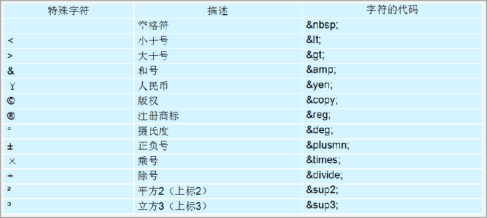

 

#前言

## 什么是网页

1. 网站是指在因特网上根据一定的规则，使用 HTML 等制作的用于展示特定内容相关的网页集合。

2. 网页是网站中的一“页”，通常是 HTML 格式的文件，它要通过浏览器来阅读。

3. 网页是构成网站的基本元素，它通常由图片、链接、文字、声音、视频等元素组成。通常我们看到的网页，常见以 .htm 或 .html 后缀结尾的文件，因此将其俗称为 HTML 文件。

## 什么是HTML

1. HTML 指的是超文本标记语言 (Hyper Text Markup Language) ，它是用来描述网页的一种语言。
2. HTML 不是一种编程语言，而是一种标记语言 (markup language)。标记语言是一套标记标签 (markup tag)。

## 总结

1. 网页是图片、链接、文字、声音、视频等元素组成, 其实就是一个html文件。
2. 网页生成制作:  有前端人员书写 HTML 文件, 然后浏览器打开,就能看到了网页.
3. HTML: 超文本标记语言, 用来制作网页的一门语言. 有标签组成的. 比如 图片标签 链接标签 视频标签等…

# HTML语法规范

1. HTML 标签是由尖括号包围的关键词，例如 <html>。

2. HTML 标签通常是成对出现的，例如 <html> 和 </html> ，我们称为**双标签。**

3. 有些特殊的标签必须是单个标签（极少情况）, 我们称为**单标签。**例如 <br />
4. 注释：<!-- 在此处写注释 -->

# HTML基本结构标签

每个网页都会有一个基本的结构标签（也称为骨架标签），页面内容也是在这些基本标签上书写。

```html
<html> # 根标签
		<head> # 头标签
				<title>我的第一个页面</title> # 标题标签
 		</head>
 		<body> #主体标签
 				你我之间,黑马洗练,月薪过万,一飞冲天 
 		</body>
</html>
```


# html5骨架标签

```html
<!DOCTYPE html>	 #文档类型声明标签

<html lang="en">  # language的缩写，"en"——英文网页；"zh-CN"——中文网页.

<head>
    <meta charset="UTF-8"> # 定义字符集
    <meta http-equiv="X-UA-Compatible" content="IE=edge">
    <meta name="viewport" content="width=device-width, initial-scale=1.0">
    <title>Document</title>
</head>

<body>
</body>

</html>
```

## DOCTYPE
    <!DOCTYPE html>  文档类型声明标签,，告诉浏览器使用的是哪种版本的HTML。这样写默认html5
    
    1. <!DOCTYPE> 声明位于文档中的最前面的位置，处于 <html> 标签之前。
    2. < !DOCTYPE >不是一个 HTML 标签，它就是 文档类型声明标签。

## lang 定义语言种类

```
用来定义当前文档显示的语言。
	1. en定义语言为英语
	2. zh-CN定义语言为中文
简单来说,定义为en 就是英文网页, 定义为 zh-CN 就是中文网页。其实对于文档显示来说，定义成en的文档也可以显示中文，定义成zh-CN的文档也可以显示英文
```

## charset定义字符集

```html
	1. 在<head>标签内，可以通过<meta> 标签的 charset 属性来规定 HTML 文档应该使用哪种字符编码.  
	2. <meta charset=" UTF-8" />  

	上面语法是必须要写的代码，否则可能引起乱码的情况。一般情况下，统一使用“UTF-8”编码，尽量统一写成标准的 "UTF-8"，不要写成  "utf8" 或 "UTF8"。
```

# HTML常用标签

## 标题标签< h>

HTML 提供了 6 个等级的网页标题，即<h1> --- <h6> 。

自动独占一行内容！

```html
<h1>标题一共六级选,</h1>
<h2>文字加粗一行显。</h2>
<h3>由大到小依次减，</h3>
<h4>从重到轻随之变。</h4>
<h5>语法规范书写后，</h5>
<h6>具体效果刷新见。</h6>
						-----这不是标题
```

##  段落，换行标签< p>< br/>

- < p >标签用于定义段落，它可以将整个网页分为若干个段落。p是单词 paragraph的缩写，意为段落。

  （分开的两个段落有较大间距）

- < br />换行标签，直接加在需要换行的后面。即break**（单标签）**

  （换行后无间距，只是简单的再起一行）

```html
<p> 我是一个段落标签 </p>

我是中国人<br />中国人不骗中国人
```

## 文字特性标签

要为文字设置**粗体**、*斜体* 或下划线等效果，使文字以特殊的方式显示。

- 加粗：<strong>---<strong>
- 倾斜：<em>---<em>
- 删除线：<del>---<del>
- 下划线：<ins>---<ins>

## < div > 和< span >标签

< div > 和 < span > 是没有语义的，它们就是一个盒子，用来装内容的。

- div 是 division 的缩写，表示分割、分区。

  ​	一个<div>独占一行。 大盒子

- span 意为跨度、跨距。

  ​	一行上可以多个 <span>。小盒子

```html
<div> 这是头部 </div> 后面写的没有用了
<span> 今日价格 </span> 后面还可以加<span>
```

## 图像标签(单)< img>

< img src="path"> 标签用于定义 HTML 页面中的图像。

​	src 是标签的**必须属性**，它用于指定图像文件的路径和文件名。

```html
 
```

- 图像标签的基本属性：key=”value“

  

属性之间不分先后顺序，标签名与属性、属性与属性之间**均以空格分开**。 

## 超链接标签< a>

< a > 标签用于定义超链接，作用是从一个页面链接到另一个页面。


- 链接的语法格式

  ```html
  <a href="跳转目标" target="目标窗口的弹出方式"> 显示在页面文本或图像 </a>
  ```

- 链接的分类

  **1.外部链接**: 例如 

```html
  < a href="http:// www.baidu.com "> 百度</a >
```

​		**2.内部链接**: 网站内部页面之间的相互链接. 直接链接内部页面名称即可，

```html
 < a href="index.html"> 首页 </a >
```

​		**3.空链接**:  如果当时没有确定链接目标时，

```html
< a href="#"> 首页 </a > 
```

​		**4.下载链接**: 如果 href 里面地址是一个文件或者压缩包，会下载这个文件。

```html
< a href="都是学习.zip"> 下载CCooky学习宝典 </a > 
```

​		**5.网页元素链接**: 在网页中的各种网页元素，如文本、图像、表格、音频、视频等都可以添加超链接.

```html
< a href="http:// www.baidu.com ">
    
</a >
```

​		**6.锚点链接:**  点我们点击链接,可以快速定位到页面中的某个位置. 

```html
第一步：在链接文本的 href 属性中，设置属性值为 #名字 的形式，
			如<a href="#two"> 点击定位到第2集 </a>
第二步：找到目标位置标签，里面添加一个 id 属性 = 刚才的名字，
			如<h3 id="two">这是 第2集介绍</h3>
```

# 注释

<!-- 注释语句 -->   	**快捷键: ctrl + /** 

# 特殊字符



# 表格标签< table>

​			**表格是用来显示数据的**，属性我们通过CSS设置。

## 1. 基本语法

<td>是普通单元格；<th>是表头单元格table ; <tr> 行 标签 ; <thead> 表格头部区域标签; 

<tbody> 表格主体区域标签;  <table> 表格标签

```html
<table>
 		<tr>  table row
      	<th>我是表头哦，加粗居中</th>	table head
 				<td>单元格内的文字，图片，链接等等</td>  table data
 					...
 		</tr>
		 ...
</table>


1.<table> </table> 是用于定义表格的标签。
2.<th> 表示HTML表格的表头部分，会加粗居中显示。
2.<tr> </tr> 标签用于定义表格中的行，必须嵌套在 <table> </table>标签中。
3.<td> </td> 用于定义表格中的单元格，必须嵌套在<tr></tr>标签中。
4. 字母 td 指表格数据（table data），即数据单元格的内容。
```

## 2. 表格属性

表格标签这部分属性我们实际开发我们不常用，后面通过 CSS 来设置.

目的有2个: 

1. 记住这些英语单词,后面 CSS 会使用.

2. 直观感受表格的外观形态


## 3. 表格结构标签

使用场景:因为表格可能很长,为了更好的表示表格的语义，可以将表格分割成 表格头部和表格主体两大部分.

在表格标签中，分别用：< thead >标签表格的头部区域、< tbody >标签 表格的主体区域. 这样可以更好的分清表格结构。

```html
1. <thead></thead>：用于定义表格的头部。<thead> 内部必须拥有 <tr> 标签,一般是位于第一行。
2. <tbody></tbody>：用于定义表格的主体，主要用于放数据本体 。
```

## 4. 合并单元格

- 合并单元格方式： 

   跨行合并：rowspan="合并单元格的个数" ,**最上侧单元格**为目标单元格, 写合并代码

   跨列合并：colspan="合并单元格的个数", **最左侧单元格**为目标单元格, 写合并代码

- 合并单元格三步曲：

  1. 先确定是跨行还是跨列合并。

  2. 找到目标单元格. 写上合并方式 = 合并的单元格数量。

     比如：<td colspan="2"></td>。

​				  3. 删除多余的单元格。

# 列表标签< ul>< ol>

​						**列表就是用来布局的**，属性我们通过CSS设置。

列表最大的特点就是整齐、整洁、有序，它作为布局会更加自由和方便。

根据使用情景不同，列表可以分为三大类：**无序列表**、**有序列表**和**自定义列表**。


## 1. 无序列表

< ul > 标签表示 无序列表，列表项使用 <li> 标签定义。

​	ul="unordered list";	li = "list item";

```html
<ul>
 		<li>列表项1</li>
 		<li>列表项2</li>
 		<li>列表项3</li>
 		...
</ul>
```

1. 无序列表的各个列表项之间没有顺序级别之分，是并列的。

2. < ul> </ul> 中只能嵌套 <li>  </li>，直接在 <ul>  </ul> 标签中输入其他标签或者文字的做法是不被允许的。

3. <li> 与 </li> 之间相当于一个容器，可以容纳所有元素。

4. 无序列表会带有自己的样式属性，但在实际使用时，我们会使用 CSS 来设置。

## 2. 有序列表

< ol> 标签用于定义有序列表，列表**排序以数字显示**(123..)，并且使用 <li> 标签来定义列表项。

```html
<ol>
 		<li>列表项1</li>
 		<li>列表项2</li>
 		<li>列表项3</li>
 		...
</ol>
```

注意事项同无序列表

## 3. 自定义列表

自定义列表的使用场景:

​		自定义列表常用于对术语或名词进行解释和描述，定义列表的列表项前没有任何项目符号。


< dl> 标签用于自定义列表， <dt>（定义项目/名字）； < dd>（描述每一个项目/名字）

​		dl = "define list";	dt = "define thead";  	dd = "define data"

```html
<dl>
 		<dt>名词1</dt>
 		<dd>名词1解释1</dd>
 		<dd>名词1解释2</dd>
</dl>
```

<dt> 和 <dd>个数没有限制，经常是一个<dt> 对应多个<dd>。

# 表单标签

使用表单目的是为了收集用户信息。

网页中的表单展示：


##  表单的结构

**表单域**、**表单控件**（也称为表单元素）和 **提示信息**3个部分构成。

**表单元素**有 input 输入表单元素 select 下拉表单元素 textarea 文本域表单元素.

这三组表单元素都应该包含在**form表单域**里面,并且有 **name** 属性


## 表单域< form>

**表单域**是一个**包含表单元素**的区域。  

< form> 标签用于定义表单域，< form> 会把它范围内的表单元素信息提交给服务器.

```html
<form action=“url地址” method=“提交方式” name=“表单域名称">
 				各种表单元素控件
</form>
```

常用属性：


## 表单元素

表单元素就是允许用户在表单中**输入**或者**选择**的内容控件。

​		1. input 输入表单元素

​		2. select 下拉表单元素

​		3. textarea 文本域元素

### < input> 表单元素(单标签)

用户进行输入信息的控件。

```html
<input type="属性值" />
```


- input的其他属性

  

  1. name 和value 是每个表单元素都有的属性值,主要给后台人员使用.

  2. name 表单元素的名字, 要求**单选按钮**和**复选框**要有相同的name值.

  3. checked主要针对于**单选按钮**和**复选框**, 主要作用一打开页面,就要可以默认选中某个表单元素.

  4. maxlength 是用户可以在表单元素输入的最大字符数, 一般较少使用.
  5. value——是在页面加载时，默认显示的值。

Example：

```html
    <form action="xxx.php" method="get">
        <!-- text 文本框 用户可以里面输入任何文字 -->
        用户名: <input type="text" name="username" value="请输入用户名" maxlength="6">   <br> 
        <!-- password 密码框 用户看不见输入的密码 -->
        密码: <input type="password" name="pwd" >  <br> 
        <!-- radio 单选按钮  可以实现多选一 -->
        <!-- name 是表单元素名字 这里性别单选按钮必须有相同的名字name 才可以实现多选1 -->
        <!-- 单选按钮和复选框可以设置checked 属性, 当页面打开的时候就可以默认选中这个按钮 -->
        性别: 男 <input type="radio" name="sex" value="男"> 女  <input type="radio" name="sex" value="女" checked="checked"> 人妖   <input type="radio" name="sex" value="人妖">   <br> 
        <!-- checkbox 复选框  可以实现多选 -->
        爱好: 吃饭 <input type="checkbox" name="hobby" value="吃饭"> 睡觉 <input type="checkbox" name="hobby">  打豆豆 <input type="checkbox" name="hobby" checked="checked"> 
        <br> 
        <!-- 点击了提交按钮,可以把表单域 form 里面的表单元素里面的值 提交给后台服务器 -->
        <input type="submit" value="免费注册">
        <!-- 重置按钮可以还原表单元素初始的默认状态 -->
        <input type="reset" value="重新填写">
        <!-- 普通按钮 button  后期结合js 搭配使用-->
        <input type="button" value="获取短信验证码"> <br>
        <!-- 文件域 使用场景 上传文件使用的 -->
        上传头像:  <input type="file" >
    </form>
```

### < select>下拉表单元素

```html
<select>
 		<option>选项1</option>
	  <option>选项2</option>
 		<option>选项3</option>
 		...
</select>
```

在<option> 中定义 selected =“ selected " 时，当前项即为默认选中项。

### < textarea> 文本域表单元素

```html
<textarea rows="3" cols="20">
 				文本内容
</textarea>
```

cols=“每行中的字符数” ，rows=“显示的行数”，我们在实际开发中不会使用，都是用 CSS 来改变大小。

# < label>标签

< label> 标签为 input 元素定义标注（标签）。

< label> 标签用于绑定一个表单元素, 当点击< label> 标签内的文本时，浏览器就会自动将焦点(光标)转到或者选择对应的表单元素上,用来增加用户体验.

**核心：** 

< label> 标签的 **for 属性**应当与相关表单元素的 **id** **属性**相同。

```html
<label for="sex">这里是绑定的文字图像等等</label>
<input type="radio" name="sex" id="sex" />
```

# 综合案例


```html
<body>
    <h4>青春不常在，抓紧谈恋爱</h4>
    <table width="600">
        <!-- 第一行 -->
        <tr>
            <td>性别:</td>
            <td>
                <input type="radio" name="sex" id="nan"> <label for="nan">  男 </label>
                <input type="radio" name="sex" id="nv"> <label for="nv"> 女</label>
            </td>
        </tr>
        <!-- 第二行 -->
        <tr>
            <td>生日:</td>
            <td>
                <select>
                    <option>--请选择年份--</option>
                    <option>2001</option>
                    <option>2002</option>
                    <option>2003</option>
                </select>
                <select>
                    <option>--请选择月份--</option>
                    <option>1</option>
                    <option>2</option>
                    <option>3</option>
                </select>
                <select>
                    <option>--请选择日--</option>
                    <option>1</option>
                    <option>2</option>
                    <option>3</option>
                </select>

            </td>
        </tr>
        <!-- 第三行 -->
        <tr>
            <td>所在地区</td>
            <td><input type="text" value="北京思密达"></td>
        </tr>
        <!-- 第四行 -->
        <tr>
            <td>婚姻状况:</td>
            <td>
                <input type="radio" name="marry" checked="checked">未婚 <input type="radio" name="marry"> 已婚 <input
                    type="radio" name="marry"> 离婚
            </td>
        </tr>
        <!-- 第五行 -->
        <tr>
            <td>学历:</td>
            <td><input type="text" value="博士后"></td>
        </tr>
        <!-- 第六行 -->
        <tr>
            <td>喜欢的类型:</td>
            <td>
                <input type="checkbox" name="love"> 妩媚的
                <input type="checkbox" name="love"> 可爱的
                <input type="checkbox" name="love"> 小鲜肉
                <input type="checkbox" name="love"> 老腊肉
                <input type="checkbox" name="love" checked="checked"> 都喜欢
            </td>
        </tr>
        <!-- 第七行 -->
        <tr>
            <td>个人介绍</td>
            <td>
                <textarea>个人简介</textarea>
            </td>
        </tr>
        <!-- 第八行 -->
        <tr>
            <td></td>
            <td>
                <input type="submit" value="免费注册">
            </td>
        </tr>
        <tr>
            <td></td>
            <td>
                <input type="checkbox" checked="checked"> 我同意注册条款和会员加入标准
            </td>
        </tr>
        <tr>
            <td></td>
            <td>
                <a href="#"> 我是会员，立即登录</a>
            </td>
        </tr>
        <tr>
            <td></td>
            <td>
                <h5>我承诺</h5>
                <ul>
                    <li>年满18岁、单身</li>
                    <li>抱着严肃的态度</li>
                    <li>真诚寻找另一半</li>
                </ul>
            </td>
        </tr>

    </table>
</body>
```


