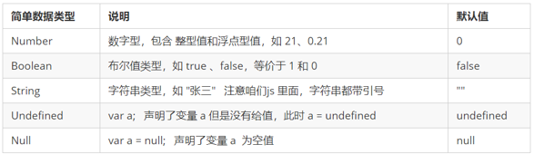

# 注意事项

1. HTML中使用**双引号**,  JS 中使用**单引号**
2.  加不加分号看自己.
3. 对象——花括号；数组——中括号

# 1. JavaScript 是什么

- 注意到：前面两个html，CSS都不是编程语言，是一种标记语言。这里JS是编程语言了。
- JS是一种运行在客户端的脚本语言 （Script 是脚本的意思）
- 脚本语言：不需要编译，运行过程中由 js 解释器( js 引擎）逐行来进行解释并执行


**浏览器执行 JS** ：

浏览器分成两部分：渲染引擎和 JS 引擎

-  **渲染引擎**：用来解析HTML与CSS，俗称内核，比如 chrome 浏览器的 blink ，老版本的 webkit

-  **JS 引擎**：也称为 JS 解释器。 用来读取网页中的JavaScript代码，对其处理后运行，比如 chrome  浏览器的 V8。

浏览器本身并不会执行JS代码，而是通过内置 JavaScript 引擎(解释器) 来执行 JS 代码 。JS 引擎执行代码时逐行解释每一句源码（转换为机器语言），然后由计算机去执行，所以 JavaScript 语言归为脚本语言，会逐行解释执行。

**JS 的组成**：


- **ECMAScript** 是由ECMA 国际（ 原欧洲计算机制造商协会）进行标准化的一门编程语言，这种语言在万维网上应用广泛，它往往被称为 JavaScript 或 JScript，但实际上后两者是 ECMAScript 语言的实现和扩展。

- **DOM**是W3C组织推荐的处理可扩展标记语言的标准编程接口。通过 DOM 提供的接口可以对页面上的各种元素进行操作（大小、位置、颜色等）。

- **BOM** 是指浏览器对象模型，它提供了独立于内容的、可以与浏览器窗口进行互动的对象结构。通过BOM可以操作浏览器窗口，比如弹出框、控制浏览器跳转、获取分辨率等。

# 2. JS引入方式(script任意位置)

注意哦：对于内嵌式而言

​		CSS（style）只能放在**head标签内部**；而JS（script）可以放在**任意位置**，head/body

**行内式JS：**

```html
<input type="button" value="点我试试" onclick="alert('Hello World')" />
```

- 可以将单行或少量 JS 代码写在HTML标签的事件属性中（**以 on 开头的属性**），如：onclick
- 注意单双引号的使用：在HTML中我们推荐使用**双引号**,  JS 中我们推荐使用**单引号**

**内嵌式JS：**

```html
 <script>
    alert('Hello  World~!');
 </script>
```

**外部JS：**

```html
<script src="my.js">引用外部 JS文件的 script 标签中间不可以写代码(就是这里)</script>
```

# 3. 注释方法

- 单行注释：//		 ctrl  +  /	(同java)
- 多行注释：/*     */         默认  alt +  shift  + a    修改成 ctrl + shift  +  /  

# 4. JS输入输出语句

| **方法**         | **说明**                       | **归属** |
| ---------------- | ------------------------------ | -------- |
| alert(msg)       | 浏览器弹出警示框               | 浏览器   |
| console.log(msg) | 浏览器控制台打印输出信息       | 浏览器   |
| prompt(info)     | 浏览器弹出输入框，用户可以输入 | 浏览器   |

prompt函数返回输入的数据。

**注意**：alert() 主要用来显示消息给用户，console.log() 用来给程序员自己看运行时的消息。

# 5. JS里面的变量

## 1. 声明方式

```javascript
var age = 18, name = 'zq' // 这个和python的声明变量方式一样，很方便
var x = 19
var x = 'name' //JS是动态类型，这样赋值没问题
```

## 2. 数据类型

-  简单数据类型 （**Number, String, Boolean, Undefined, Null**）



​		**Number属性**：

​				数字型的三个特殊值：Infinity ，代表无穷大，大于任何数值

​													  - Infinity ，代表无穷小，小于任何数值

​														NaN ，Not a number，代表一个非数值

​		**String属性：**

​					**length；**

​					**+ 号**用于字符串拼接，拼接前会把与字符串相加的任何类型转成字符串，再拼接成一个新的字符串； 

​					js里面规矩比较简单，带了单引号的就是String类型。转义字符直接在单引号的内部使用。和Java一样滴。

```javascript
var str = '我是一个"高富帅"\n程序员'
console.log(str)
```

​		**Boolean：**

​						布尔型和数字型相加的时候， true 的值为 1 ，false 的值为 0。

```javascript
console.log(true + 1)	//2
console.log(false + 1)	//1
```


-  **复杂数据类型 （object)**

## 3. typeof

typeof 可用来获取检测变量的数据类型

```javascript
var num = 18;
console.log(typeof num) // 结果 number 
```

## 4. 数据类型转换

### 1. 转换成字符串


第三种方式比较好

### 2. 转换成数字型


- 注意 parseInt 和 parseFloat 单词的大小写，这2个是重点
- 隐式转换是我们在进行算数运算的时候，JS 自动转换了数据类型

### 3. 转换成布尔型


- 代表空、否定的值会被转换为 false  ，如 ''、0、NaN、null、undefined  
- 其余值都会被转换为 true

# 6. 三元表达式

```javascript
表达式1 ? 表达式2 : 表达式3;		(同java)
```

# 7. JS流程控制

**同JAVA的判断，循环。一模一样！**

- 判断：

  if		switch

- 循环：

  for		while		do while		continue break

# 8. 数组

## 1. 创建方式

数组中可以存放**任意类型**的数据，例如字符串，数字，布尔值等。

```javascript
var arr = new Array();   // 创建一个新的空数组

var arr2 = ['小白','小黑','小白', 12, true, 28.9]	// js数组可以存放任意类型
```

## 2. 数组属性

```javascript
arr.length  // 数组长度

for(var i = 0; i < arr.length; i++ )  { 
   console.log( arr[i] );
}
```

## 3. 新增数组元素（不同Java）

1. 修改 length 长度新增数组元素（java是不能修改的）

   ```javascript
   var arr = ['red', 'green', 'blue', 'pink'];
   arr.length = 7;
   console.log(arr);
   console.log(arr[4]);
   console.log(arr[5]);
   console.log(arr[6]);
   
   其中索引号是 4，5，6 的空间没有给值，就是声明变量未给值，默认值就是 undefined。
   ```

2. 修改数组索引新增数组元素(常用)

   ​		JS里面的数组没有辣么严格，和python一样比较灵活。

   ```javascript
   var arr = [];
   arr[0] = 'hotpink';
   console.log(arr);
   ```

# 9. 函数（java--方法）

## 1. 声明（同Matlab）

```javascript
// 声明函数
function 函数名(形参列表) {
    //函数体代码
  return 返回值
}

Example：
//定义一个获取数组中最大数的函数
function getMaxFromArr(numArray){
    var maxNum = 0;
    for(var i = 0;i < numArray.length;i++){
        if(numArray[i] > maxNum){
            maxNum = numArray[i];
        }
    }
    return maxNum;
}

```

- 注意到，**形参**是 ”泛型“ 哦，不限制传入什么类型数组，舒服舒服
- 在使用 return 语句时，函数会停止执行，并返回指定的值
- 每个函数都是有返回值的。 如果函数没有 return ，返回的值是 undefined

## 2. arguments

1. **注意哦：**

​		在JS里面实参形参的个数**不需要匹配**哦，这个也太舒服了吧。

```javascript
function sum(num1, num2) {
    console.log(num1 + num2);
}
sum(100, 200);             // 形参和实参个数相等，输出正确结果
sum(100, 400, 500, 700);   // 实参个数多于形参，只取到形参的个数
sum(200);               // 实参个数少于形参，多的形参定义为undefined，结果为NaN
```

2. **由此，JS引入了arguments对象**

在 JavaScript 中，arguments 实际上它是当前函数的一个内置对象。

所有函数都内置了一个 arguments 对象，arguments 对象中存储了传递的**所有实参**。


3. **arguments展示形式是一个伪数组**，因此可以进行遍历。

   伪数组具有以下特点：

   ​		具有 length 属性

   ​		按索引方式储存数据

   ​		不具有数组的 push , pop 等方法

4. **arguments的使用例子**

```javascript
function maxValue() {
      var max = arguments[0];
      for (var i = 0; i < arguments.length; i++) {
         if (max < arguments[i]) {
                    max = arguments[i];
         }
      }
      return max;
}
 console.log(maxValue(2, 4, 5, 9));
 console.log(maxValue(12, 4, 9));
```

# 10. JS的预解析

JavaScript 解析器在运行 JavaScript 代码的时候分为两步：预解析和代码执行。

- **预解析**：在当前作用域下, JS 代码执行之前，浏览器会默认把带有 var 和 function 声明的变量在内存中进行提前声明或者定义。
- **代码执行**： 从上到下执行JS语句。

预解析只会发生在通过 var 定义的变量和 function 上。学习预解析能够让我们知道为什么在变量声明之前访问变量的值是 **undefined**，为什么在函数声明之前就可以调用函数。

# 11. 对象

## 创建方式

**三种**创建方式，**两种**调用对象的属性。

### **字面量创建对象(冒号)**

采取键值对的形式表示，**花括号 { }** 里面包含了表达这个具体事物（对象）的属性和方法

- 键：相当于属性名
-  值：相当于属性值，可以是任意类型的值（数字类型、字符串类型、函数类型等）

```javascript
// 创建对象
var star = new Object({
    name : 'pink',
    age : 18,
    sex : '男',
    sayHi : function(){
        alert('大家好啊~');
    }
});
// 可以不写Object，系统就会默认创建Object实例对象
var star = {
    name : 'pink',
    age : 18,
    sex : '男',
    sayHi : function(){
        alert('大家好啊~');
    }
};
// 两种调用对象属性方法
console.log(star.name)     // 调用名字属性
console.log(star['name'])  // 调用名字属性
star.sayHi();              // 调用 sayHi方法一定不要忘记带后面的括号
```

### **new Object创建对象（等号）**

跟我们前面学的  new Array()  原理一致。使用的格式：**对象.属性 =  值**;     

```javascript
var andy = new Obect();
andy.name = 'pink';
andy.age = 18;
andy.sex = '男';
andy.sayHi = function(){
    alert('大家好啊~');
}
```

### **构造函数创建对象**

```javascript
function Person(name, age, sex) {
     this.name = name;
     this.age = age;
     this.sex = sex;
     this.sayHi = function() {
      alert('我的名字叫：' + this.name + '，年龄：' + this.age + '，性别：' + this.sex);
    }
}

var bigbai = new Person('大白', 100, '男');
var smallbai = new Person('小白', 21, '男');
console.log(bigbai.name);
console.log(smallbai.name);
```

**注意:**

1.   构造函数约定**首字母大写**。
2.   函数内的**属性和方法**前面需要添加 **this** ，表示当前对象的属性和方法。
3.   构造函数中**不需要 return** 返回结果。

4. 当我们创建对象的时候，**必须用 new** 来调用构造函数。

## 遍历对象属性

for...in 语句用于对数组或者对象的属性进行循环操作。

```javascript
var obj = {
  name : 'zhouquan',
  age : 18,
  sex : '男'，
}
// 
for (var k in obj) {
    console.log(k);      // 这里的 k 是属性名(name, age, sex)
    console.log(obj[k]); // 这里的 obj[k] 是对应属性值(必须这样写)
}
```

# 12. 内置对象

JavaScript 中的对象分为3种：自定义对象 、内置对象、 浏览器对象。

前面两种对象是JS 基础 内容，属于 ECMAScript；  第三个浏览器对象属于我们JS 独有的， 我们JS API 讲解。

内置对象就是指 JS 语言自带的一些对象，这些对象供开发者使用，并提供了一些常用的或是最基本而必要的功能（属性和方法）。

 JavaScript 提供了多个内置对象：Math、 Date 、Array、String等。

## 1. MDN

学习一个内置对象的使用，只要学会其常用成员的使用即可，我们可以通过查文档学习，可以通过MDN/W3C来查询。

MDN:   https://developer.mozilla.org/zh-CN/

## 2. Math对象

## 3. Date对象

是一个构造函数，需要实例化后才能使用。

```javascript
// 获取当前时间
var now = new Date();
console.log(now);
// 获取之前的时间(字符串型参数)
var data = new Data('2020-10-1 12:30:10')
console.log(data)

// 格式化日期 年月日 
<script>
        var date = new Date();
        var year = date.getFullYear();
        var month = date.getMonth() + 1;
        var dates = date.getDate();
        var arr = ['星期日', '星期一', '星期二', '星期三', '星期四', '星期五', '星期六'];
        var day = date.getDay();
        console.log('今天是：' + year + '年' + month + '月' + dates + '日 ' + arr[day]);
</script>

// 格式化日期 时分秒
<script>
        var date = new Date();
        // 要求封装一个函数返回当前的时分秒 格式 08:08:08
        function getTimer() {
            var time = new Date();
            var h = time.getHours();
            h = h < 10 ? '0' + h : h;
          
            var m = time.getMinutes();
            m = m < 10 ? '0' + m : m;
          
            var s = time.getSeconds();
            s = s < 10 ? '0' + s : s;
            return h + ':' + m + ':' + s;
        }
        console.log(getTimer());
</script>

// 获得Date总的毫秒数(时间戳)  
//不是当前时间的毫秒数 而是距离1970年1月1号过了多少毫秒数
    <script>
        // 1. 通过 valueOf()  getTime()
        var date = new Date();
        console.log(date.valueOf()); // 就是 我们现在时间 距离1970.1.1 总的毫秒数
        console.log(date.getTime());
        // 2. 简单的写法 (最常用的写法)
        var date1 = +new Date(); // +new Date()  返回就是当前时间总的毫秒数
				var date1 = +new Date(2020-10-1 12:30:15);
        console.log(date1);
    </script>
```


### 案例：倒计时

```javascript
    <script>
        // 倒计时效果
        // 1.核心算法：输入的时间减去现在的时间就是剩余的时间，即倒计时 ，但是不能拿着时分秒相减，比如 05 分减去25分，结果会是负数的。
        // 2.用时间戳来做。用户输入时间总的毫秒数减去现在时间的总的毫秒数，得到的就是剩余时间的毫秒数。
        // 3.把剩余时间总的毫秒数转换为天、时、分、秒 （时间戳转换为时分秒）
        // 转换公式如下： 
        //  d = parseInt(总秒数/ 60/60 /24);    //  计算天数
        //  h = parseInt(总秒数/ 60/60 %24)   //   计算小时
        //  m = parseInt(总秒数 /60 %60 );     //   计算分数
        //  s = parseInt(总秒数%60);            //   计算当前秒数
        function countDown(time) {
            var nowTime = +new Date(); // 返回的是当前时间总的毫秒数
            var inputTime = +new Date(time); // 返回的是用户输入时间总的毫秒数
            var times = (inputTime - nowTime) / 1000; // times是剩余时间总的秒数 
        
            var d = parseInt(times / 60 / 60 / 24); // 天
            d = d < 10 ? '0' + d : d;
      
            var h = parseInt(times / 60 / 60 % 24); //时
            h = h < 10 ? '0' + h : h;
      
            var m = parseInt(times / 60 % 60); // 分
            m = m < 10 ? '0' + m : m;
      
            var s = parseInt(times % 60); // 当前的秒
            s = s < 10 ? '0' + s : s;
      
            return d + '天' + h + '时' + m + '分' + s + '秒';
        }
        console.log(countDown('2019-5-1 18:00:00'));
        var date = new Date();
        console.log(date);
    </script>
```

