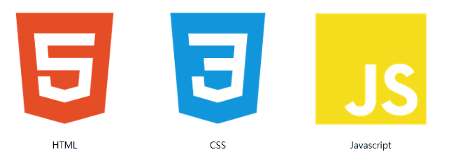
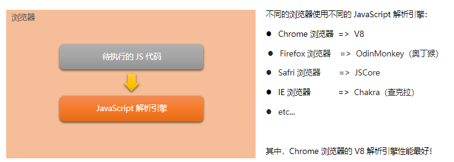
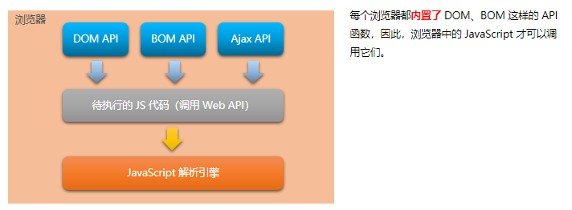
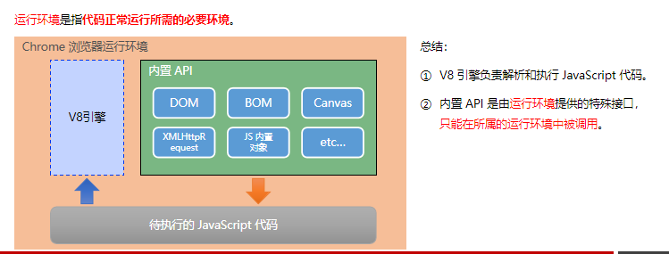
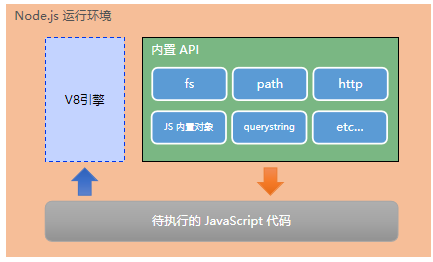

# 思考与回顾

- **回顾：**我们已经掌握了三个技术。

- **问题一：**

为什么我们的JS代码可以在浏览器中执行呢，为什么我们之前直接从vscode打开浏览器，就可以直接看到写的JS代码的动态效果呢？

因为浏览器里面有一个JS引擎，它可以解析JS代码。

- **问题二：**

为什么JavaScript可以操作浏览器里面的DOM和BOM呢？

因为：浏览器里面内置了各种各样的API，如DOM API、BOM API 、Ajax API等等，这些API可以被待执行的JS代码调用，然后我们浏览器的JS引擎去解析这些代码，可以操作这些函数。

- **问题三：**

浏览器中JavaScript的运行环境？

Chrome浏览器运行环境：

- **思考：**

  ​     **JavaScript是否可以做后端呢？**

  答案是可以的！！！JavaScript是一门解释性语言，也可以做后端，只是说我们需要借助一个东西——Node.JS才行，不能单独使用JS做后端开发。

  当我们写好了代码，放在浏览器里面的时候，浏览器有运行环境，所以可以运行，现在这就是前端开发。

  如果我们将写好的JS代码运行在Nodejs里面，Nodejs也是一个运行环境，这是后端的运行环境，跑在这里面就是后端开发。

# Node.js简介

Node.js® is a **JavaScript runtime** built on Chrome's V8 JavaScript engine.

**Node.js** 是一个基于 Chrome V8 引擎的 **JavaScript 运行环境。**

**注意：**

- 浏览器是 JavaScript 的**前端运行环境**。
- Node.js 是 JavaScript 的**后端运行环境**。
- Node.js 中**无法调用** DOM 和 BOM 等浏览器内置 API。

## Node.js 可以做什么

Node.js 作为一个 JavaScript 的运行环境，仅仅提供了基础的功能和 API。然而，基于 Node.js 提供的这些基础能，很多强大的工具和框架如雨后春笋，层出不穷，所以学会了 Node.js ，可以让前端程序员胜任更多的工作和岗位：

- 基于 Express 框架（http://www.expressjs.com.cn/），可以快速构建 Web 应用
- 基于 Electron 框架（https://electronjs.org/），可以构建跨平台的桌面应用
- 基于 restify 框架（http://restify.com/），可以快速构建 API 接口项目

- 读写和操作数据库、创建实用的命令行工具辅助前端开发、etc…

总之：Node.js 是大前端时代的“大宝剑”，有了 Node.js 这个超级 buff 的加持，前端程序员的行业竞争力会越来越强！

## Node.js 怎么学

- **浏览器中的 JavaScript 学习路径：**

JavaScript 基础语法 + 浏览器内置 API（DOM + BOM） + 第三方库（jQuery、art-template 等）

- **Node.js 的学习路径：**

JavaScript 基础语法 + Node.js 内置 API 模块（fs、path、http等）+ 第三方 API 模块（express、mysql 等）

## 什么是终端

终端（英文：Terminal）是专门为开发人员设计的，用于实现人机交互的一种方式。

作为一名合格的程序员，我们有必要识记一些常用的终端命令，来辅助我们更好的操作与使用计算机。

**终端快捷键：**

在 Windows 的 powershell 或 cmd 终端中，我们可以通过如下快捷键，来提高终端的操作效率：

- 使用 ↑ 键，可以快速定位到上一次执行的命令
- 使用 tab 键，能够快速补全路径
- 使用 esc 键，能够快速清空当前已输入的命令
- 输入 cls 命令，可以清空终端