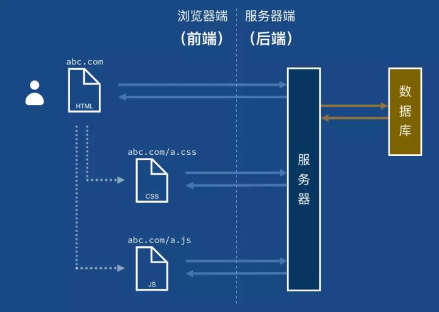
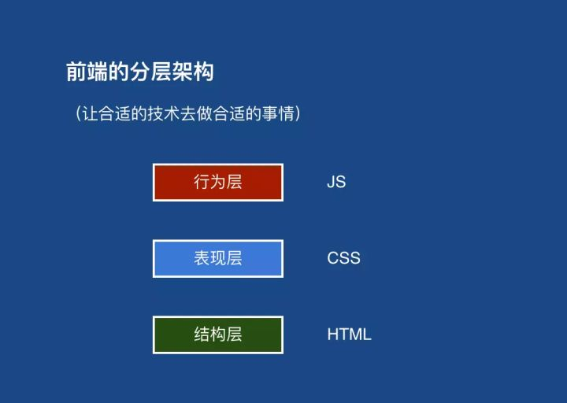
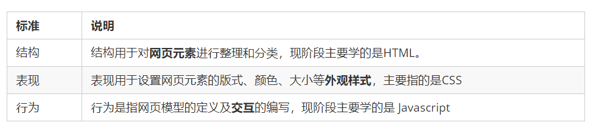

# 什么是前端

**三大块**：

- HTML，定义了网页的内容
- CSS，描述了网页的布局
- Javascript（JS）控制了网页的行为

# 分层架构

- **结构层**：这一层的作用是表述一个页面中有哪些信息，以及这些信息之间的关系是什么。这一层在技术上是由 HTML 来实现的。
- **表现层**：这一层决定了页面中的信息会以什么样的外观呈现出来。这一层由 CSS 来实现。
- **行为层**：这一层控制了页面如何与用户进行交互。在传统的展示型网页中，可能只需要 “结构层” 和 “表现层” 就足以提供完整的功能；而现代网页承载了越来越多的交互，这就推动 “行为层” 的能力不断增强。这一层由 JS 来实现。

#web标准：

+  Web 标准是由 W3C 组织和其他标准化组织制定的一系列标准的集合。W3C（万维网联盟）是国际最著名的标准化组织。

#为什么需要Web标准：

+ 浏览器不同，它们显示页面或者排版就有些许差异

  

- 遵循 Web 标准除了可以让不同的开发人员写出的页面更标准、更统一外，还有以下优点：
  1.让 Web 的发展前景更广阔。 
  2.内容能被更广泛的设备访问。
  3.更容易被搜寻引擎搜索。
  4.降低网站流量费用。
  5.使网站更易于维护。
  6.提高页面浏览速度。

# web标准的构成

主要包括 《结构Structure》 、《表现（Presentation）》和《行为（Behavior）》三个方面。

Web 标准提出的最佳体验方案：**结构、样式、行为相分离**。  
		简单理解：**结构写到 HTML 文件中， 表现写到 CSS 文件中， 行为写到 JavaScript 文件中**

